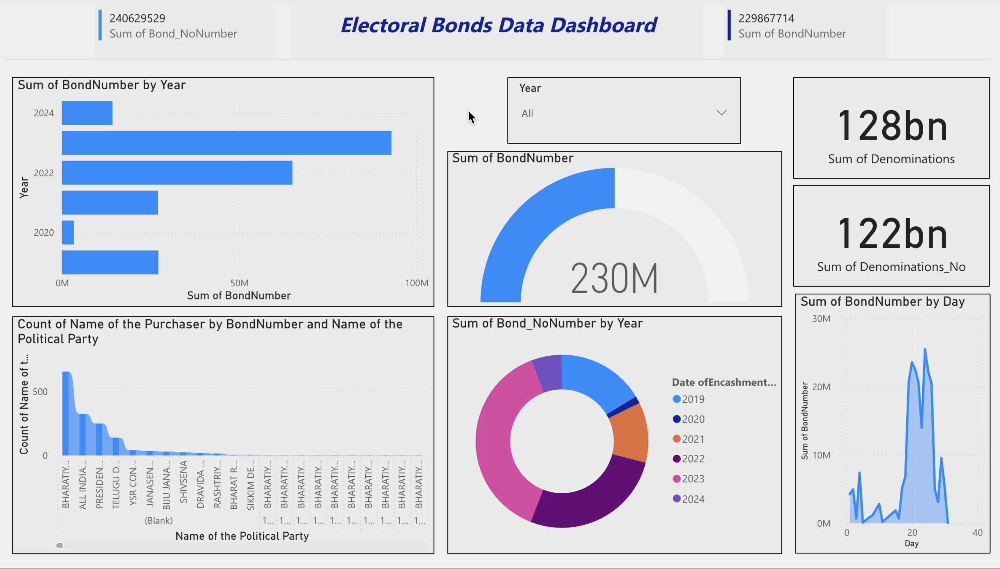

# ElectoralDataSet_Python
To prepare a detailed description for GitHub, let's summarize the analysis and findings of the notebook.

---

## Electoral Bond Analysis

### Overview
This Jupyter Notebook analyzes electoral bond data to identify discrepancies between donor and receiver records and summarizes bond amounts over the years.

### Data Description
The analysis is based on two datasets:
1. `receiver_data`: Contains information about bonds received by political parties.
2. `donors_data`: Contains information about bonds purchased by donors.

### Key Steps and Findings

#### 1. **Loading Data**
The datasets are loaded into Pandas DataFrames for analysis.

#### 2. **Exploring Data**
Initial exploration includes checking the current working directory and previewing the first few rows of each dataset to understand their structure.

#### 3. **Unique Bond Numbers**
- **Receiver Data:**
  ```python
  unique_bond_no_in_receiver_data = receiver_data['bond_no'].unique()
  ```
  - Extracts unique bond numbers from the receiver data.
  
- **Donor Data:**
  ```python
  unique_bond_no_in_donors_data = donors_data['bond_no'].unique()
  ```
  - Extracts unique bond numbers from the donor data.

- **Lists of Unique Bond Numbers:**
  ```python
  unique_bond_no_in_receiver_data = list(unique_bond_no_in_receiver_data)
  unique_bond_no_in_donors_data = list(unique_bond_no_in_donors_data)
  ```

#### 4. **Discrepancies in Bond Numbers**
- **Difference Calculation:**
  ```python
  difference = set(unique_bond_no_in_receiver_data) - set(unique_bond_no_in_donors_data)
  ```
  - Finds bond numbers present in the receiver data but not in the donor data.
  
- **Count of Unmatched Bond Numbers:**
  ```python
  len(difference)  # Outputs: 860
  ```
  - There are 860 bond numbers in the receiver data that do not match any bond numbers in the donor data.
  
- **List of Unmatched Bond Numbers:**
  ```python
  bond_no_match_not_found = list(difference)
  ```

#### 5. **Rows with Unmatched Bond Numbers**
- **From Receiver Data:**
  ```python
  match_not_found_donor = receiver_data[receiver_data['bond_no'].isin(difference)]
  ```
  - Retrieves rows from the receiver data where the bond numbers do not match any in the donor data.

#### 6. **Summarizing Bond Amounts by Year**
- **Aggregation by Year:**
  ```python
  donors_data.groupby(['purchase_date_year'])['bond_amount'].sum()
  ```
  - Sums the bond amounts for each year, providing a summary of total bond amounts over the years.


  
